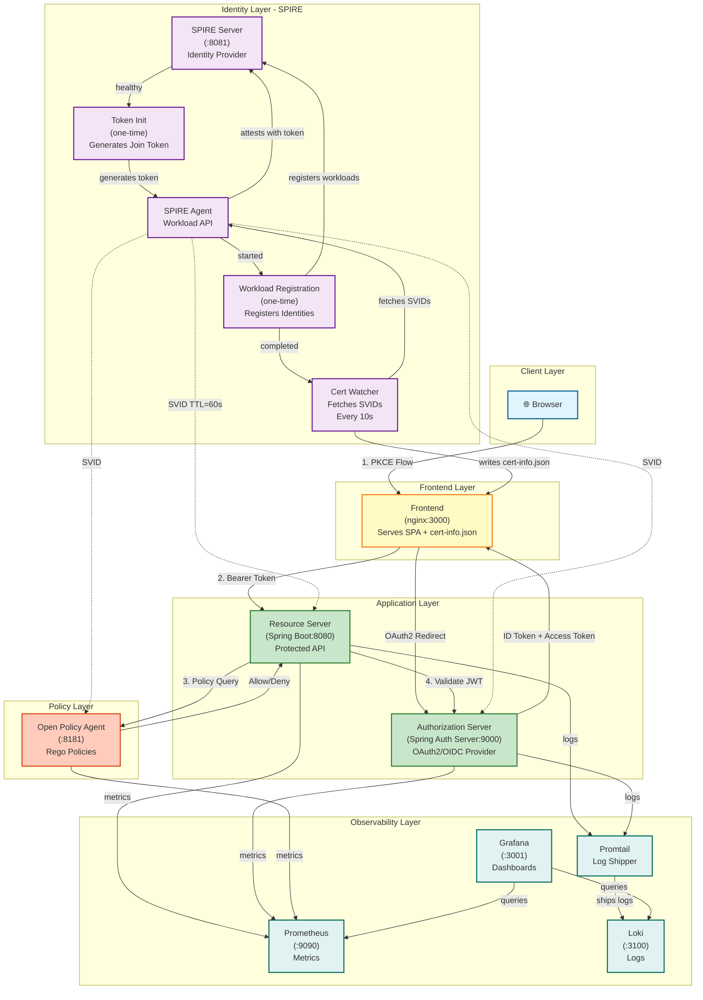
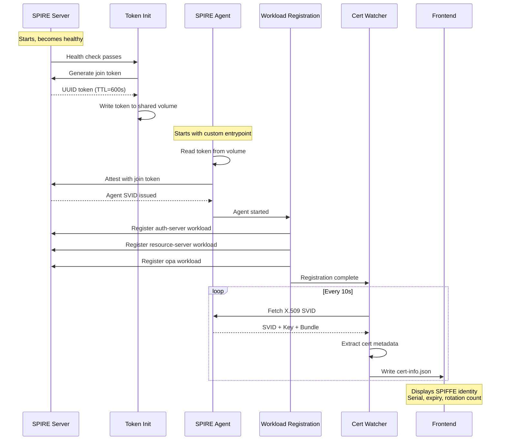

# 🔐 Secure by Default — Spring IO Demo

> **Spring IO 2025** · *Secure-by-Default Spring Apps: Zero Trust, OAuth2, and Runtime Policies*

A complete, runnable demo showing how to build **Zero Trust Spring applications** with:

- 🔑 **OAuth2/OIDC** with [Spring Authorization Server](https://spring.io/projects/spring-authorization-server)
- 🛡️ **Policy-as-Code** authorization with [Open Policy Agent (OPA)](https://www.openpolicyagent.org/)
- 🔒 **mTLS Workload Identity** with [SPIFFE/SPIRE](https://spiffe.io/)
- 📊 **Security Observability** with Prometheus, Loki, and Grafana
- 🏗️ **Certificate-Bound Tokens** (JWT thumbprints / `cnf` claim)
- 📝 **Rich Audit Logging** for compliance and SRE telemetry

---

## Architecture



### Architecture Overview

The system implements a **Zero Trust architecture** with multiple security layers:

1. **Client Layer**: Browser-based SPA with OAuth2 PKCE flow
2. **Frontend Layer**: nginx reverse proxy serving static assets and proxying API calls
3. **Application Layer**: Spring Boot microservices with OAuth2 Resource Server
4. **Policy Layer**: OPA for externalized authorization decisions
5. **Identity Layer**: SPIRE for automatic workload identity with X.509 SVIDs
6. **Observability Layer**: Prometheus, Loki, Grafana for security telemetry

---

## Quick Start

### Prerequisites

- **Docker** 24+ and **Docker Compose** v2
- Ports available: `3000`, `3001`, `8080`, `8081`, `9000`, `9090`, `3100`

### Start the Demo

```bash
# Clone and start
git clone https://github.com/isaric/spring-io-secure-by-default.git
cd spring-io-secure-by-default

# Start all services (first run builds Docker images — takes ~3 min)
docker compose up --build

# Or start without SPIRE (lighter, for core demo):
docker compose up --build auth-server resource-server opa frontend prometheus loki promtail grafana
```

**What happens on first startup:**

1. **SPIRE Server** starts and becomes healthy
2. **Token Init** generates a fresh join token and writes it to a shared volume
3. **SPIRE Agent** reads the token and attests with the server
4. **Workload Registration** automatically registers the three workload identities
5. **Cert Watcher** begins fetching X.509 SVIDs every 10 seconds
6. **Frontend** displays live certificate rotation at http://localhost:3000

The entire SPIRE bootstrap is **fully automated** — no manual token generation or workload registration required!

### Service URLs

| Service | URL | Credentials |
|---------|-----|-------------|
| 🌐 **Frontend Demo** | http://localhost:3000 | — |
| 🔑 **Authorization Server** | http://localhost:9000 | — |
| 📦 **Resource Server** | http://localhost:8080 | — |
| 🛡️ **OPA** | http://localhost:8181 | — |
| 📊 **Grafana** | http://localhost:3001 | admin / demo1234 |
| 🔍 **Prometheus** | http://localhost:9090 | — |

### Demo Users

| Username | Password | Roles | Department |
|----------|----------|-------|------------|
| `alice` | `password` | ADMIN, USER | engineering |
| `bob` | `password` | USER | marketing |
| `carol` | `password` | USER, AUDITOR | finance |

---

## Demo Script

### 1. OAuth2 PKCE Flow

1. Open http://localhost:3000
2. Click **Login** — observe redirect to `http://localhost:9000`
3. See the login page (Spring-themed)
4. Log in as `alice / password`
5. Observe the consent screen listing scopes: `openid`, `profile`, `resource:read`
6. After consent → redirected back to frontend with authorization code
7. Frontend exchanges code for tokens (PKCE verification server-side)
8. **Token Inspector** shows decoded JWT with custom claims: `roles`, `department`

### 2. Role-Based Access Control

1. As **alice** (ADMIN): click **Load Documents** → sees ALL documents (all departments, all classifications)
2. As **bob** (USER): log out and log in as `bob / password`, click **Load Documents** → sees only `public` docs and `marketing` dept docs
3. As **alice** (ADMIN): try **Admin Panel → List Users** → SUCCESS
4. As **bob** (USER): try **Admin Panel → List Users** → `403 Forbidden`

### 3. OPA Policy Demo (Live Update)

The OPA policies are in `./opa/policies/authz.rego` and are loaded at startup.

**Try updating a policy live:**
```bash
# Currently, restricted_hours blocks access between 22:00–06:00
# Let's observe OPA decisions in real time:
docker compose logs -f opa
```

Make a live policy change:
```bash
# Edit opa/policies/authz.rego to change business hours or add a new rule
# OPA loads policies from the /policies directory, no restart needed
# (OPA watches the filesystem or you can POST to its REST API)

# Post a policy update via OPA REST API:
curl -X PUT http://localhost:8181/v1/policies/authz \
  --data-binary @opa/policies/authz.rego
```

### 4. Certificate-Bound Tokens (JWT Thumbprints)

The Authorization Server embeds client certificate thumbprints in issued JWTs via the `cnf` claim:

```json
{
  "sub": "alice",
  "roles": ["ADMIN", "USER"],
  "department": "engineering",
  "cnf": {
    "x5t#S256": "<sha256-of-client-cert>"
  }
}
```

The Resource Server validates this thumbprint against the incoming client certificate when mTLS is enabled.

### 5. SPIFFE Identity & Live Certificate Rotation

The frontend displays real-time SPIFFE workload identity and certificate rotation:

1. Open http://localhost:3000 (no login required for this section)
2. Scroll to the **SPIFFE Identity — Live Certificate Rotation** card
3. Observe:
   - **SPIFFE ID**: `spiffe://demo.spring.io/resource-server`
   - **Serial Number**: Unique certificate identifier
   - **Expiration**: Countdown timer showing time until renewal
   - **Rotation Count**: Increments every ~60 seconds when cert rotates
   - **Certificate Metadata**: Issuer, fingerprint, validity period

**Watch a live rotation:**
```bash
# Monitor cert-watcher logs in real-time
docker logs -f spire-cert-watcher

# Expected output every ~60 seconds:
# [watch-certs] 2026-03-20T13:05:42Z | rotation #45 | serial=A1B2C3... | expires=Mar 20 13:06:52 2026 GMT
```

The certificates rotate automatically with a 60-second TTL (configurable in `spire/register-workloads.sh`). The frontend polls `/cert-info.json` every 5 seconds to display updates in real-time.

### 6. Audit Logs in Grafana

1. Open Grafana: http://localhost:3001 (admin / demo1234)
2. Navigate to **Dashboards → Spring IO — Secure by Default**
3. Observe:
   - **Audit Events Over Time** — rate of security events by action
   - **Audit Log Stream** — live structured audit log from Loki
   - **HTTP Request Rate** — per-endpoint traffic from Prometheus

---

## Components

### Authorization Server (`auth-server/`)

Spring Boot 3.4 + Spring Authorization Server 1.4.

**Registered Clients:**
```yaml
frontend-client:    # Public client (PKCE), Authorization Code
  scopes: openid, profile, email, resource:read

resource-server-client:  # Confidential, Client Credentials
  secret: resource-server-secret
  scopes: resource:read, resource:write, introspect

demo-client:        # Confidential, Authorization Code + Refresh
  secret: demo-secret
  scopes: openid, profile, email, resource:read, resource:write
```

**Custom JWT Claims:**
```json
{
  "roles": ["ADMIN", "USER"],
  "department": "engineering"
}
```

**Endpoints:**
- `GET  /oauth2/jwks` — JWK Set (public keys)
- `POST /oauth2/token` — Token endpoint
- `POST /oauth2/revoke` — Token revocation
- `POST /oauth2/introspect` — Token introspection
- `GET  /userinfo` — OIDC UserInfo
- `GET  /.well-known/openid-configuration` — OIDC Discovery

### Resource Server (`resource-server/`)

Spring Boot 3.4 + Spring Security OAuth2 Resource Server.

**Protected Endpoints:**

| Method | Path | Required Role | Description |
|--------|------|---------------|-------------|
| GET | `/api/public/health` | None | Health check |
| GET | `/api/public/info` | None | Service info |
| GET | `/api/documents` | Authenticated | List documents (filtered) |
| GET | `/api/documents/{id}` | Authenticated | Get document |
| POST | `/api/documents` | ADMIN | Create document |
| DELETE | `/api/documents/{id}` | ADMIN | Delete document |
| GET | `/api/admin/users` | ADMIN | List users |
| GET | `/api/admin/audit` | ADMIN or AUDITOR | View audit log |
| POST | `/api/admin/policy/reload` | ADMIN | Reload OPA policy |

**OPA Integration:**
Every request to `/api/**` is evaluated by OPA via HTTP call to `http://opa:8181/v1/data/authz/allow`. The input includes:
```json
{
  "method": "GET",
  "path": "/api/documents",
  "subject": "alice",
  "roles": ["ADMIN", "USER"],
  "department": "engineering",
  "hour": 14
}
```

### OPA Policies (`opa/policies/`)

**`authz.rego`** — Main policy with:
- Public path bypass (`/api/public/**`, `/actuator/**`)
- Authenticated read access to documents
- ADMIN-only write/delete access
- Admin endpoint protection
- AUDITOR access to audit log
- Time-based restrictions (restricted hours: 22:00–06:00)
- Deny reason metadata for audit

**`authz_test.rego`** — Policy unit tests:
```bash
# Run OPA policy tests
docker run --rm -v $(pwd)/opa/policies:/policies openpolicyagent/opa:latest test /policies -v
```

### SPIRE Configuration (`spire/`)

SPIRE provides **SPIFFE** workload identities via X.509 SVIDs with automatic certificate rotation.

#### Automated Bootstrap Sequence

The system uses a fully automated SPIRE bootstrap process:



#### Registered Workload Identities

All workloads are registered with **60-second TTL** for visible certificate rotation during demos:

| SPIFFE ID | Parent ID | Selector | TTL |
|-----------|-----------|----------|-----|
| `spiffe://demo.spring.io/auth-server` | `spiffe://demo.spring.io/agent/demo` | `docker:label:com.spring.demo.service:auth-server` | 60s |
| `spiffe://demo.spring.io/resource-server` | `spiffe://demo.spring.io/agent/demo` | `docker:label:com.spring.demo.service:resource-server` | 60s |
| `spiffe://demo.spring.io/opa` | `spiffe://demo.spring.io/agent/demo` | `docker:label:com.spring.demo.service:opa` | 60s |

#### Live Certificate Rotation

The frontend displays real-time certificate rotation metrics at http://localhost:3000:

- **SPIFFE ID**: `spiffe://demo.spring.io/resource-server`
- **Certificate Serial**: Updates every 60 seconds
- **Expiration Time**: Dynamic countdown
- **Rotation Count**: Increments with each renewal
- **Status Indicator**: Green when active, red if cert-watcher fails

The trust domain is `demo.spring.io`. Services use their SVID certificates for mTLS.

#### Key Files

- `spire/server/server.conf` — SPIRE Server configuration
- `spire/agent/agent.conf` — SPIRE Agent configuration (uses env var for token)
- `spire/register-workloads.sh` — Workload registration script (auto-runs at startup)
- `spire/watch-certs.sh` — Certificate watcher loop
- `spire/generate-token.sh` — Join token generator
- `spire/load-token-and-start.sh` — Agent entrypoint wrapper

### Observability (`observability/`)

| Component | Purpose |
|-----------|---------|
| **Prometheus** | Scrapes metrics from `/actuator/prometheus` on all Spring services + OPA |
| **Loki** | Aggregates structured logs (JSON) via Promtail |
| **Promtail** | Ships Docker container logs to Loki |
| **Grafana** | Dashboards for security telemetry, audit logs, HTTP metrics |

**Key Metrics:**
- `security.audit.events` — Counter per action/outcome
- `http.server.requests` — Standard Spring Boot HTTP metrics
- `jvm.*` — JVM memory, GC, threads

---

## Development

### Running Locally (without Docker)

**Start OPA:**
```bash
docker run -p 8181:8181 -v $(pwd)/opa/policies:/policies \
  openpolicyagent/opa:latest run --server --addr 0.0.0.0:8181 /policies
```

**Start Auth Server:**
```bash
cd auth-server
./mvnw spring-boot:run
```

**Start Resource Server:**
```bash
cd resource-server
./mvnw spring-boot:run \
  -Dspring-boot.run.jvmArguments="\
    -Dspring.security.oauth2.resourceserver.jwt.jwk-set-uri=http://localhost:9000/oauth2/jwks \
    -Dspring.security.oauth2.resourceserver.jwt.issuer-uri=http://localhost:9000 \
    -Dopa.url=http://localhost:8181"
```

**Serve Frontend:**
```bash
cd frontend
# Any static file server on port 3000, e.g.:
npx serve -p 3000 .
# or Python:
python3 -m http.server 3000
```

### Running Tests

```bash
# Auth server tests
cd auth-server && ./mvnw test

# Resource server tests
cd resource-server && ./mvnw test

# OPA policy tests
docker run --rm -v $(pwd)/opa/policies:/policies \
  openpolicyagent/opa:latest test /policies -v
```

### Making a Live Policy Change

OPA is running with a local `/policies` volume mount. To update a policy live:

```bash
# Option 1: Edit the file and use the OPA REST API to reload
curl -X PUT http://localhost:8181/v1/policies/authz \
  --data-binary @opa/policies/authz.rego

# Option 2: Restart just OPA (picks up file changes automatically on restart)
docker compose restart opa

# Verify the policy took effect
curl http://localhost:8181/v1/data/authz/allow \
  -H "Content-Type: application/json" \
  -d '{"input": {"method":"GET","path":"/api/documents","subject":"alice","roles":["ADMIN"],"department":"engineering","hour":10}}'
```

### Troubleshooting SPIRE

**Frontend shows "Waiting for SPIRE agent attestation":**

```bash
# 1. Check if workloads are registered
docker exec spire-server /opt/spire/bin/spire-server entry show \
  -socketPath /tmp/spire-server/private/api.sock | grep "SPIFFE ID"

# Expected: You should see auth-server, resource-server, opa

# 2. Check cert-watcher logs
docker logs spire-cert-watcher

# Expected: Should see rotation messages, not "no identity issued"

# 3. Verify cert-info.json is being written
docker exec frontend cat /spire-certs/cert-info.json

# Expected: {"status": "active", "spiffeId": "spiffe://demo.spring.io/resource-server", ...}

# 4. Re-run workload registration if needed
docker compose up -d spire-workload-registration
```

**SPIRE Agent won't start:**

```bash
# Check agent logs
docker logs spire-agent

# If you see "join token does not exist or has already been used":
# 1. Clean agent data directory
rm -f spire/data/agent/agent-data.json

# 2. Restart the stack to generate a fresh token
docker compose restart spire-token-init spire-agent
```

**Certificate rotation not visible in frontend:**

```bash
# Verify rotation is happening in cert-watcher
docker logs -f spire-cert-watcher

# Check the rotation count is incrementing
curl -s http://localhost:3000/cert-info.json | grep rotationCount

# Expected: Number should increase over time (every ~60s)
```

---

## Security Design Decisions

### JWT vs Reference Tokens

This demo uses **self-contained JWTs** for performance. Tradeoffs:
- ✅ No round-trip to auth server on every request
- ✅ Stateless resource server
- ❌ Cannot revoke before expiry (mitigated with short TTL: 15 min)
- ❌ JWT size grows with claims

In production, consider **reference tokens** for sensitive scenarios where immediate revocation is required.

### CSRF Disabled on Resource Server

The resource server is **stateless** (no sessions, no cookies) and uses **Bearer token authentication**. CSRF protection is only relevant when cookies are used for authentication. Disabling CSRF is correct and intentional per [Spring Security documentation](https://docs.spring.io/spring-security/reference/features/exploits/csrf.html#csrf-when).

### OPA Fail-Open vs Fail-Closed

The demo defaults to **fail-open** (`opa.fail-open=true`) if OPA is unavailable, to allow development without OPA running. **In production, always set `opa.fail-open=false`** to enforce fail-closed behavior.

### SPIRE Automated Bootstrap

This demo implements **fully automated SPIRE bootstrap** using:

- **Join token attestation**: Tokens are generated dynamically at startup via `spire-token-init` service
- **Automatic workload registration**: The `spire-workload-registration` service registers all workload identities on first startup
- **Custom agent image**: Built with shell support to read tokens from shared volumes
- **Idempotent registration**: The registration script can be safely re-run (updates existing entries)

**For production:**
- Use platform-specific attestors (AWS Instance Identity, Kubernetes Service Account, GCP Instance Identity) instead of join tokens
- Implement proper secret management for sensitive configuration
- Use longer SVID TTLs (hours/days instead of 60 seconds)
- Consider SPIRE Federation for multi-cluster trust domains
- Enable SPIRE Server HA with multiple replicas and persistent storage

---

## Talk Reference

This demo accompanies the Spring IO 2025 talk:

> **Secure-by-Default Spring Apps: Zero Trust, OAuth2, and Runtime Policies**
>
> Traditional perimeter-based security is obsolete for cloud-native applications. Modern Spring applications must adopt a secure-by-default posture that treats identity, authorization, and runtime policy enforcement as first-class concerns...

**Key takeaways checklist:**
- [ ] Use Spring Authorization Server for OAuth2/OIDC
- [ ] Design JWTs with minimal, purposeful claims
- [ ] Use PKCE for all public clients (no client secret)
- [ ] Integrate OPA for externalized, testable policy-as-code
- [ ] Use SPIFFE/SPIRE for automated workload identity
- [ ] Emit structured audit logs for every security decision
- [ ] Export security telemetry to your observability pipeline
- [ ] Test policies with automated OPA unit tests (`rego_test.rego`)
- [ ] Gate CI/CD on policy compliance checks
- [ ] Use certificate-bound tokens (cnf/x5t#S256) to prevent token theft

---

## License

Apache 2.0 — See [LICENSE](LICENSE)